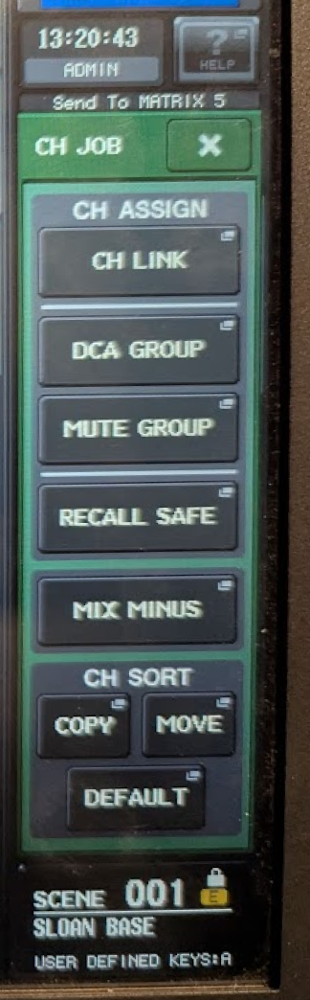
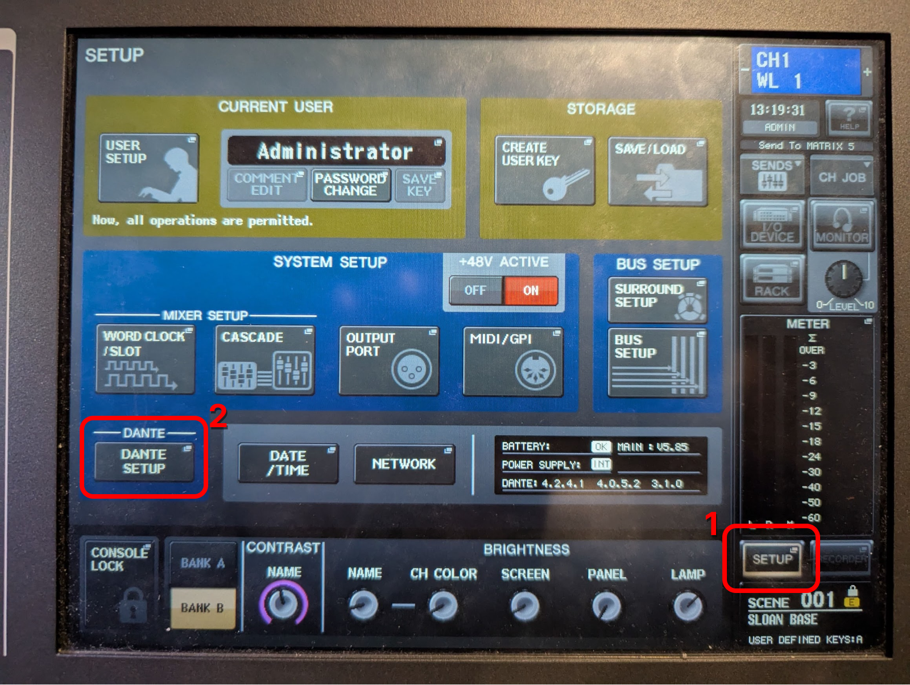
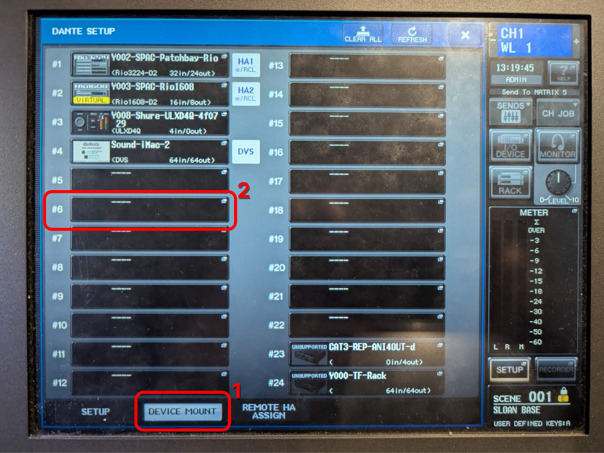
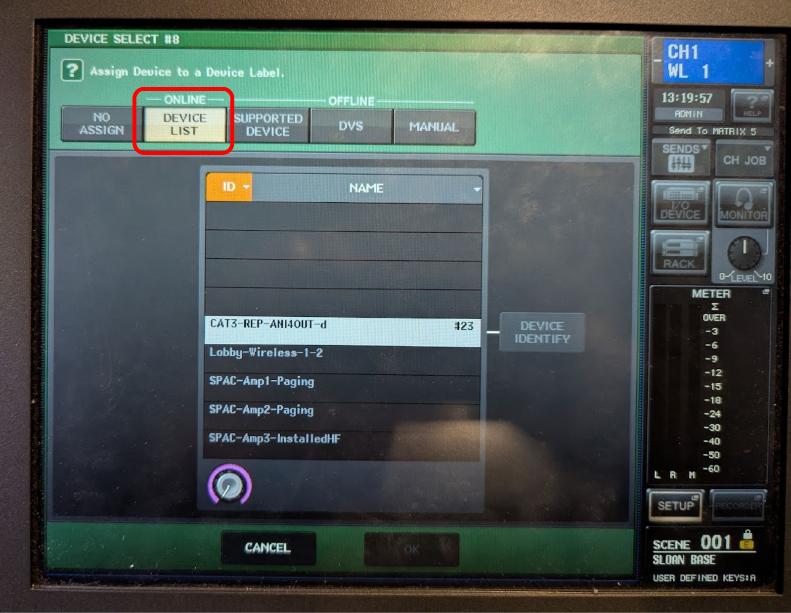
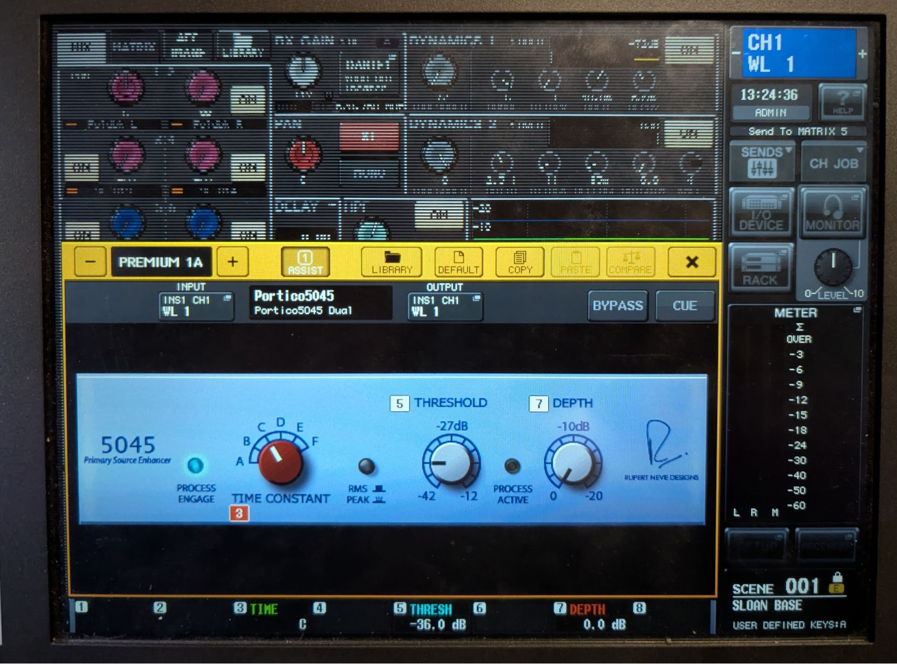
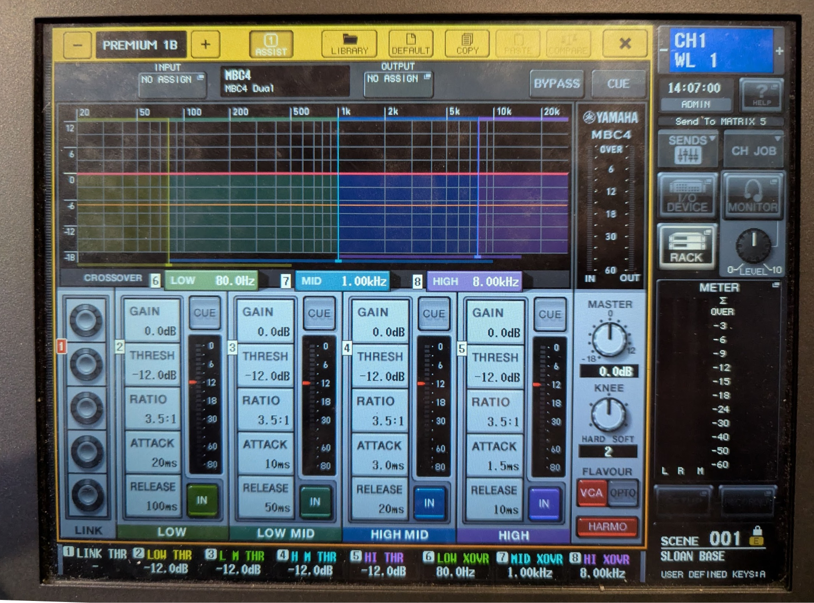
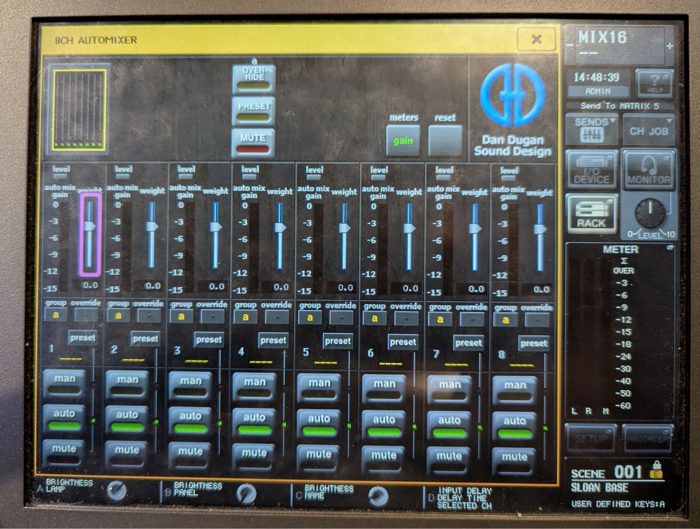

# Using the QL5

You can find the QL5 Manual [here](https://usa.yamaha.com/products/proaudio/mixers/ql_series/downloads.html#d684403). You should read it!

## Tips

- **Detailed controls page: Tap on-screen knobs twice**.

  Many controls (particularly in the channel strip view) have a more detailed screen hiding behind them. A _slow_ double-tap will open the detailed screen and show you many more options.

- **Fine adjustments: Hold down the physical knob while turning**.

  If you need to adjust a parameter more finely than the detented knob allows, turning it _while pushing it in_ will allow you to adjust more finely.

- **Stereo linking: Hold down any two channel select buttons**.

  This will open the channel link screen. Now hold the select button of one channel you want to link, and while holding it press 1 or more other select buttons to link them together. They don't need to be sequential.

- **Don't forget channel jobs!**

  Pressing the `CH JOB` button allows you to do bulk actions to multiple channels.

  

- **Beware the HELP button**.

  Pressing the Help button in the top-right of the screen will load the entire manual on-screen. It takes up to a minute to load, and you can't cancel it once it's loading. You will be locked out of the screen for this entire duration.

## Navigating with User-Defined Keys (UDKs)

Some features/pages can be accessed more easily using the user-defined hard keys to the right of the screen.

### Recommended UDK Uses

1. **Use `UDK 1` as a universal "Home" button**. No matter what menu you're in, this will return you to the default screen state.

1. **Set faders and knobs to Unity/0dB**. Hold `UDK 9`, and while holding press any channel select button or tap an on-screen knob. Doing so will set the channel fader (or on-screen knob) to 0dB.

1. **Use alternate functions**. Pressing `UDK 6` will enable all "alternate functions" on screen. Most commonly, **you can use this to adjust the digital trim instead of the analog gain.**

1. **Add your own bookmarks**. Buttons 3, 4, and 5 are unset bookmarks. If you have an on-screen page you visit frequently, open it and then hold down the UDK you'd like to assign it to.

### Default UDK assignments

The base template includes a number of preset UDKs:

| #   | Action                   |
| --- | ------------------------ |
| 1   | Selected Channel View    |
| 2   | 8-channel Overview       |
| 3   | _unused bookmark_        |
| 4   | _unused bookmark_        |
|     |                          |
| 5   | _unused bookmark_        |
| 6   | Alternate Function       |
| 7   | User-Defined Key Config  |
| 8   | Custom Fader Bank Config |
|     |                          |
| 9   | Set to 0dB               |
| 10  | Set to default value     |
| 11  | Previous UDK bank        |
| 12  | Next UDK bank            |

> [!TIP]
> If you only remember one, remember **`UDK 7`**, which will show you this list on screen.

---

## Mounting Devices

Dante is used to run audio signal between devices on the network. However, **Dante does not pass any control messages between devices.**

If you only need to pass audio to/from the QL5, **you do not need to mount the device.**

If you need to control the device, here's how to mount it.

### Mounting a Device

1. **Go to the Device Mount page** by pressing `SETUP` > `DANTE SETUP` > `DEVICE MOUNT`.

   

1. **Find an open slot.** In the Device Mount page, select any slot that doesn't have a device.

   

1. Choose your device from the **Online Devices** list.

   

1. **Wait** for up to a minute. You can try to press the refresh button in the device mount screen, but generally you just have to be patient.

---

TODO

## Adding Effects/processing

- Gate
- Compressor
- Ducker

&nbsp;

### Primary Source Enhancer (Neve Portico 5045)

### Multi-band Compressor

## Dugan Automixer

The console's automixer can be used to automatically manage the levels of up to 8 vocal microphones.

**In the Sloan BASE file, the automixer is patched into FX slots GEQ1-4.**

### Patching

For each microphone to be controlled, patch each into its own channel on the automixer.

> **Example:**
>
> Mic 1 - Insert A: GEQ1A  
> Mic 2 - Insert A: GEQ1B  
> Mic 3 - Insert A: GEQ2A  
> Mic 4 - Insert A: GEQ2B

> [!IMPORTANT]
> Most of the time, you should **insert the automixer Post-Fader**. If you do a pre insert, muting a channel will cause it to go unheard, but it will still affect the auto-mix gain pool (it will turn down other inputs.)

### How it works

The Dugan automixer is an automatic mixing tool that helps with noise reduction, clarity enhancement, and volume leveling of vocal sources, ideal for scenarios involving multiple speakers each using their own mic, particularly when participating in unscripted discussion.

It uses a technique called "gain pooling." Input channels share a gain pool, and the total gain for the system can never be greater than 1—all induced volume changes are subtractive.

The automixer determines how much of the pool to give to each of the channels based on their current behavior, turning down non-speaking inputs to make room for speaking inputs. If multiple inputs begin speaking at the same time, it will attempt to share the gain equally between them, leading to a roughly similar overall volume to when there was only one person talking.
