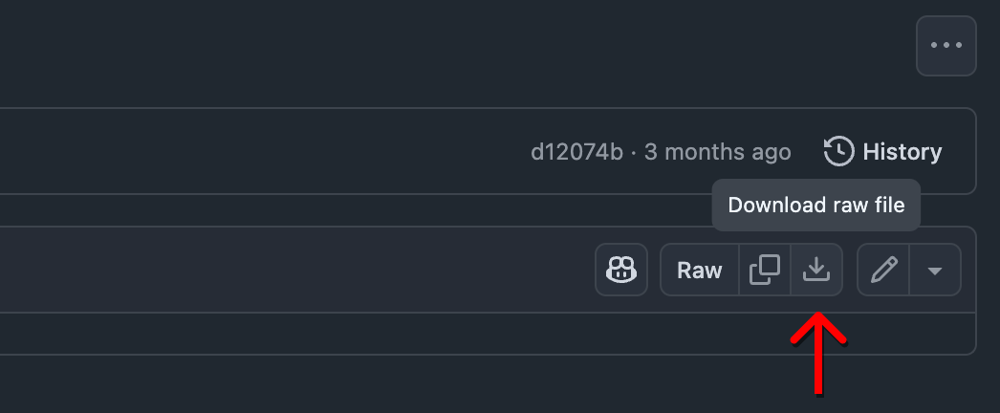

# Show File Downloads

System presets and base show files are available for download above.

## How to download

Click on a file, then click the "raw" download button in the top right.

## File Descriptions

#### SLOAN BASE:

Sloan base files are designed for the [standard rep setup](../rep/README.md).

These files contain preset patches for wireless microphones, basic QLab routing, and a simple 1:1 patching system.  
 It also contains the tuning for the 5-speaker rep speaker setup.

#### SLOAN BLANK:

Sloan blank files are designed for maximum flexibility. They contain the minimum setup required for system functionality.

The QL5 show file has an additional scene with 16 QLab inputs, designed for theatrical performances.

Additional notes:

- Use the TF-RACK file from SLOAN BASE.
- In the QLab template, use the "QL5 Advanced" audio patch or create your own.
- If you wish to use the Fulcrum mains, patch Dante directly into the first channels of the Tesira system (labelled).

#### Projection Mappings:

> [!TIP]
> To add a projection mapping file, drag it into the Qlab `Workspace Settings` > `Video` > `Video Outputs` tab (also known as "Stages").

- **`Projection Mapping - Full Cyc`**

  This projection mapping applies to the standard rep setup.

  It applies when:

  - The cyc is hung on truss US of cat 6, with a border on DS toe.
  - A traveler is hung under cat 6 and partially obscures the edges.
  - Panasonic projector is between cats 4 and 5 with its short throw lens.

  You will always need to tweak the edges in the `Warping` tab, to account for minute changes in hang position.

- Otherwise, [**create your own mapping!**](https://sloan-performing-arts-center.github.io/venue-audio/extras/qlab_video)
