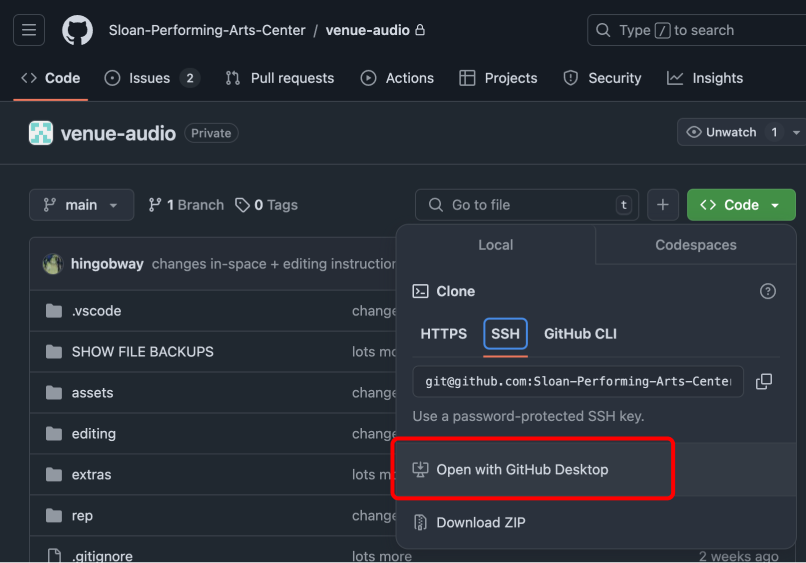
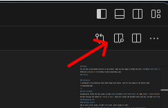
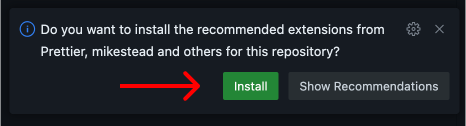

## VSCode

~~You can edit using VSCode directly in the browser. Open any docs page on GitHub and press <kbd>Shift</kbd> <kbd>.</kbd> or change the `.com` in the URL to `.dev`.~~  
**_^^ (this is pretty new and too glitchy right now [2024-11-21])_**

Otherwise [download it here](https://code.visualstudio.com).

### Downloading the project

You can access the Github project using [Github Desktop](https://desktop.github.com/download/). Their ["Getting Started" guide](https://docs.github.com/en/desktop/overview/getting-started-with-github-desktop) will get you through the basics.

After you connect to the Github project, VSCode can manage and upload changes all by itself.



> _you can also open the project using this button on the website._

### Preview

Use the preview button in the top right corner to show the document side-by-side as you edit.



Any command/action in VSCode, such as this preview button, extensions, settings, multiple cursors, formatting, etc can also be done using the Command Bar: <kbd>Cmd</kbd> <kbd>Shift</kbd> <kbd>P</kbd>.

### Extensions

I configured a few extensions which make things much easier. Look for this popup in the bottom right.



---

### Auto Formatter

Automatically format the text using <kbd>Opt</kbd> <kbd>Shift</kbd> <kbd>F</kbd>. Or right click > `Format Document`.

OR open settings and enable for `Format on Save`, which will format the document every time you <kbd>Cmd</kbd> <kbd>S</kbd>.

### Saving Changes

Use the **Source Control** tab to manage your changes and upload them to the GitHub project.

You need to do three things to add your changes to the online project:

1. (OPTIONAL) **Stage your changes**. If you don't manually stage changes, all changes will be staged for you.

   Staged changes are the changes that will be committed and uploaded; any unstaged changes will remain on your computer and can be uploaded later.

   You can use the `+` button next to a file or click to open the file and stage only a portion of that file.

1. **Create a commit**. Enter a commit message (a short explanation of what you changed) then press the blue `✅ Commit` button.

1. **Upload the commit**. You can now press `Sync Changes` to upload your local copy to GitHub.

### Manipulating Text

#### Multiple cursors

Add an extra cursor using <kbd>Opt</kbd> click. press escape to clear.

Press <kbd>Cmd</kbd> <kbd>D</kbd> to **add a cursor at the next instance of the selected text**.

Press <kbd>Cmd</kbd> <kbd>Shift</kbd> <kbd>L</kbd> to select _all_ occurrences.


#### Manipulate lines

Move the current line (or selection) using <kbd>Opt</kbd> <kbd>Up</kbd>/<kbd>Down</kbd>.

**Duplicate the current line** (or selection) using <kbd>Opt</kbd> <kbd>Shift</kbd> <kbd>Up</kbd>/<kbd>Down</kbd>.

#### Box selection

Hold <kbd>Opt</kbd> <kbd>Shift</kbd> while dragging to create a box selection.


### Linking to sections/Renaming sections

Headings are marked by starting a line with 1-4 hashes `#`.

When you create a heading, it is automatically added to the page outline, and the heading gets its own direct URL.

When you create a `[link](https://url.com)`, **you can link directly between pages and headings**.

You can **browse for pages and subheadings** by putting your cursor inside the parentheses for a link, and pressing <kbd>Ctrl</kbd> <kbd>Space</kbd>.

Relative links are made up of a relative file path and a heading hash, separated by a `#`:


#### Renaming Headings

Heading links are created based on the heading text—if you change the heading title, it will break any links you've made.

**If you need to change a heading title, VSCode can automatically update links for you.**  
Just select the heading text, press <kbd>F2</kbd>, then enter your new name. All links will be auto-updated if needed.

> [!TIP]
> You can also access the rename dialog by right-clicking a heading and choosing `Rename Symbol`.

### Snippets

Snippets are text shortcuts for commonly-used actions. Type one of the phrases below, press <kbd>Ctrl</kbd> <kbd>Space</kbd>, and select it from the list.

I have added a few to this project, and you can add more to your own computer.

- Add an image `img`
- Add the table separator bar `tbl`
- Make a blank line `nl`
- Add a centered image `cimg`
- Add a page break for PDFs `pgb`

## Markdown

See [markdownguide.org](https://www.markdownguide.org/cheat-sheet/) for Markdown syntax. There's really not too much.

A few "extensions" I use a lot:

### Tables

```md
| Heading | Heading | Heading |
| ------- | ------- | ------- |
| Data    | Data    | Data    |
| Data    | Data    | Data    |
```

> | Heading | Heading | Heading |
> | ------- | ------- | ------- |
> | Data    | Data    | Data    |
> | Data    | Data    | Data    |

### Checklists

```md
- [ ] unchecked item
  - [ ] unchecked subtask
- [x] checked item
```

> - [ ] unchecked item
>   - [ ] unchecked subtask
> - [x] checked item

### Lists

I prefer using all `1`s for lists. markdown will figure out the numbers for you this way.

```md
1. This is a list item with more lines.

   Indent lines to maintain numbering.

1. Another list item.

---

4. This list will count up starting at 4.
1. def
1. ghi
1. jkl
```

> 1. This is a list item with more lines.
>
>    Indent lines to maintain numbering.
>
> 1. Another list item.
>
> ---
>
> 4. This list will count up starting at 4.
> 1. def
> 1. ghi
> 1. jkl

### Images

When editing on Github, you can paste or drag an image directly into the text to include it.

Doing this in VSCode will save the image file into the project and reference it. Please move image files into a subfolder to avoid making folders too difficult to navigate.
