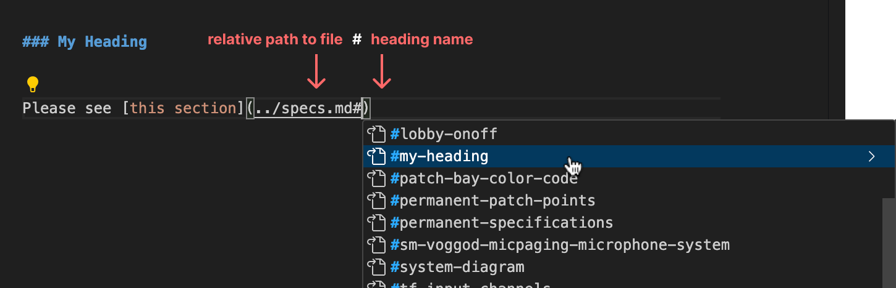

# Editing this documentation

This documentation site is written in Markdown, more specifically Github-flavored Markdown (GFM). Markdown is designed to be easily readable in its original plain-text form, while also allowing for rich formatting of the text when rendered.

Markdown/GFM is widely used for documentation sites, so you can find many resources online about how to write with it and render it.

The procedures below highlight my recommendations.

## Edit online on Github

The simplest way to make small changes is to use the editor built into the Github website.

1. Click the pencil icon on any docs page to open the editor.
1. Make any changes you'd like to make.
1. Press `Commit changes...` and write a brief message explaining what you changed.

You're done!

> [!CAUTION]
> Be careful about **changing heading names** using the online editor!
>
> Links to sections are based on their heading text, so changing a heading name will also change its link. **Any links to that heading will no longer function.** You can [easily avoid this in VSCode](#renaming-headings).

## Editing using VSCode

For more complex editing, it is much more efficient to download the project and edit the docs locally on your machine using Visual Studio Code.

[Download VSCode here](https://code.visualstudio.com).

### Extensions

Before you do anything else, you'll need to install few extensions to work with this project:

- [Prettier](https://marketplace.visualstudio.com/items?itemName=esbenp.prettier-vscode) auto-formats the Markdown text files (removing extra spaces, standardizing tab sizes, etc.)
- [Code Spell Checker](https://marketplace.visualstudio.com/items?itemName=streetsidesoftware.code-spell-checker) adds Microsoft Word-style spell-checking.
- [Github Markdown Preview](https://marketplace.visualstudio.com/items?itemName=bierner.github-markdown-preview) makes the built-in preview look like Github.
- [Markdown+Math](https://marketplace.visualstudio.com/items?itemName=goessner.mdmath) adds support for a few math equations in these docs.

### Accessing the Project

You can connect directly to the Github project using VSCode and access most features of the program. If you're already comfortable with Git/Github, you're welcome to skip these steps and clone the project locally instead. Otherwise, follow these steps:

1. **Open the "Remote Window" menu**.

   

1. **Choose `Open Remote Repository...`**

   

1. **Enter the project's Github URL**. (You might be prompted to log into your Github account.)

   ```
   https://github.com/Sloan-Performing-Arts-Center/venue-audio.git
   ```

   

### User Interface

VSCode has many features, most of which you can ignore. Here are the ones you need to know:


1. **File Explorer**: Browse project files in this sidebar on the left.
2. **Source Control**: Use this tab to upload your changes to the website.
3. **Markdown Preview**: When you open a Markdown file, click this button to open the page preview on the right side (as shown above).
4. **Document Outline**: Click here to jump to any heading on the page.

### Important: Auto Formatting

Whenever you edit a page, you should run the auto-formatter to keep the Markdown text document standardized.

**Right-click > `Format Document` to format the file.** You can also use keyboard shortcut <kbd>Opt</kbd> <kbd>Shift</kbd> <kbd>F</kbd>.

Please always format the document before you upload your changes!

### Saving your Changes

Use the [**Source Control** tab](#user-interface) to manage your changes and upload them to the GitHub project.


> The Source Control tab. Next to each file, use the plus button to "stage" it, or the back arrow to discard changes.

**To upload your changes, follow these steps**:

1. **Stage your changes**. Staged changes are the changes that will be committed and uploaded; any unstaged changes will remain on your computer and can be uploaded later.

   You can use the `+` button next to a file or click to open the file and stage only a portion of that file.

   > [!TIP]
   > If you don't manually stage changes, all changes will be staged for you.

1. **Write what you changed**. Type a commit message (a short explanation of what you changed) in the message box at the top of the panel.

1. **Press `Commit & Push**. Your changes will be uploaded!

### Line Wrapping

Use <kbd>Opt</kbd> <kbd>Z</kbd> (or `View > Word Wrap`) to toggle "Word Wrap", which determines whether long lines of text wrap onto a new line (this is only applied on your computer).

**When writing text, you'll want it ON**, so that you can see everything you're writing.

**When editing tables, you'll want it OFF**, so that the table formatting is clear.

### Linking to sections & Renaming sections

Headings are marked by starting a line with 1-4 hashes `#`.

When you create a heading, it is automatically added to the page outline, and the heading gets its own direct URL.

When you create a `[link](https://url.com)`, **you can link directly between pages and headings**.

You can **browse for pages and subheadings** by putting your cursor inside the parentheses for a link, and pressing <kbd>Ctrl</kbd> <kbd>Space</kbd>.

Relative links are made up of a relative file path and a heading hash, separated by a `#`:



#### Renaming Headings

> [!CAUTION]
> Heading links are created based on the heading text—if you change the heading title, it will break any links you've made.

**If you need to change a heading title, VSCode can automatically update links for you.**  
Just select the heading text, press <kbd>F2</kbd>, then enter your new name. All links will be auto-updated if needed.

You can also access the rename dialog by right-clicking a heading and choosing `Rename Symbol`.

### Manipulating Text

#### Multiple cursors

Add an extra cursor using <kbd>Opt</kbd> click. press escape to clear.

Press <kbd>Cmd</kbd> <kbd>D</kbd> to **add a cursor at the next instance of the selected text**.

Press <kbd>Cmd</kbd> <kbd>Shift</kbd> <kbd>L</kbd> to select _all_ occurrences.


#### Manipulate lines

Move the current line (or selection) using <kbd>Opt</kbd> <kbd>Up</kbd>/<kbd>Down</kbd>.

**Duplicate the current line** (or selection) using <kbd>Opt</kbd> <kbd>Shift</kbd> <kbd>Up</kbd>/<kbd>Down</kbd>.

#### Box selection

Hold <kbd>Opt</kbd> <kbd>Shift</kbd> while dragging to create a box selection.


### Snippets

Snippets are text shortcuts for commonly-used actions. Type one of the phrases below, press <kbd>Ctrl</kbd> <kbd>Space</kbd>, and select it from the list.

I have added a few to this project, and you can add more to your own computer.

- Add an image `img`
- Add an image with specified width `wimg`
- Add a centered image `cimg`
- Add the table separator bar `tbl`
- Make a blank line `nl`
- Add a centered image `cimg`
- Add a page break for PDFs `pgb`

## Markdown

See [markdownguide.org](https://www.markdownguide.org/cheat-sheet/) for Markdown syntax. There's really not too much.

A few "extensions" I use a lot:

### Tables

```md
| Heading | Heading | Heading |
| ------- | ------- | ------- |
| Data    | Data    | Data    |
| Data    | Data    | Data    |
```

> | Heading | Heading | Heading |
> | ------- | ------- | ------- |
> | Data    | Data    | Data    |
> | Data    | Data    | Data    |

### Checklists

```md
- [ ] unchecked item
  - [ ] unchecked subtask
- [x] checked item
```

> - [ ] unchecked item
>   - [ ] unchecked subtask
> - [x] checked item

### Lists

I prefer using all `1`s for lists. markdown will figure out the numbers for you this way.

```md
1. This is a list item with more lines.

   Indent lines to maintain numbering.

1. Another list item.

---

4. This list will count up starting at 4.
1. def
1. ghi
1. jkl
```

> 1. This is a list item with more lines.
>
>    Indent lines to maintain numbering.
>
> 1. Another list item.
>
> ---
>
> 4. This list will count up starting at 4.
> 1. def
> 1. ghi
> 1. jkl

### Images

When editing on Github, you can paste or drag an image directly into the text to include it.

Doing this in VSCode will save the image file into the project and reference it. Please move image files into a subfolder to avoid making folders too difficult to navigate.
