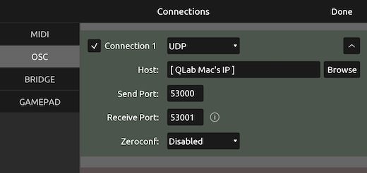

# QLab GO Controller

The **QLab GO Controller** TouchOSC patch provides a simple interface for an operator to remotely control QLab using another device.

This file was designed for shows where you have a separate sound board operator, who only needs basic QLab functions. This frees up the QLab mac for cue programming at the same time as rehearsals.

---

### [Click to Download →](https://github.com/sloan-performing-arts-center/venue-audio/raw/refs/heads/main/SHOW%20FILE%20BACKUPS/QLab%20GO%20Controller.tosc)

---

## Setup

Follow these steps to set up the controller on your device.

1. **Prepare your devices.**

   [Download TouchOSC](https://hexler.net/touchosc#get) on the device you'd like to control QLab from (usually an iPad).

   Make sure both your control device and your QLab computer are on the same LAN network.

1. **Prepare your QLab Workspace.**

   In your QLab Workspace Settings, Navigate to `Network > OSC Access`.

   Ensure that `View` and `Control` permissions are enabled with No Passcode.

   Take note of your computer's IP address for later.

   

1. **Import the TouchOSC file.**

   Open TouchOSC, and press the import button in the top right.

   Then press _Import_ and select the `QLab GO Controller.tosc` file.

   

1. **Connect OSC to QLab.**

   Open the connections tab:

   

   Then fill out an OSC connection as shown, using your Mac's IP address from step 1.

   

   You may wish to uncheck other unused connections to save bandwidth, but it usually makes no difference.

1. **Run the program.**

   Just click the play button at the top of the screen! The selected cue name and number should immediately appear.

## GO Controller vs. QLab Remote vs. QLab Collaboration Mode

QLab makes their own excellent remote control options for use with QLab. Each has its own pros and cons. Let's examine a few use cases:

#### I want to see what's happening in QLab, but not edit or control it.

> Use an official QLab product in Read-Only mode:
>
> - **QLab Remote** for iPads and iPhones
> - **QLab Collaboration Mode** for Macs
>
> Both tools _can be used for free_ in read-only mode, and can show you the entire cue list, actively running cues, and the current timestamp within a running cue.

#### I want to remotely edit QLab cues and properties.

> Use **QLab Collaboration Mode**, or VNC screen sharing.
>
> The former requires a Mac, but both can be used for free.

#### I want to remotely play cues in QLab, but I don't need to edit them.

> Use **QLab Collaboration Mode** if a Mac is available (disable edit access). Do not use the QLab Remote app—it is too easy to accidentally edit cues.
>
> Otherwise, use **GO Controller**!

## Troubleshooting

### My cue names are blank

Unfortunately, TouchOSC can only see _manually written_ cue names; it can't see the ones generated automatically by QLab.

To fix this for any specific cue: select the cue, and on your keyboard press <kbd>Q</kbd> then <kbd>Enter</kbd>. This will turn the automatic cue name into a manual cue name.
