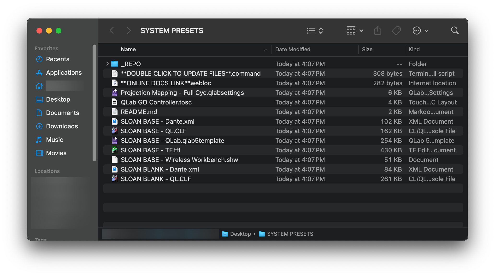

# Installing Show Files Locally

Sloan computers should all have access to the online show files right from the desktop's **`SYSTEM PRESETS`** folder.



## Checking for show file updates

It's important to make sure the local show files are up to date before using one of them.

To do so, double-click the `**DOUBLE CLICK TO UPDATE**` file in Finder; this will open a Terminal window that downloads any new updates. Once the window says **_SUCCESS!_**, you can quit the terminal window.

If the files fail to update, you can also always [find them on Github](https://github.com/Sloan-Performing-Arts-Center/venue-audio/tree/main/SHOW%20FILE%20BACKUPS#readme).

## Setting up the System Presets folder

If the folder ever gets deleted, or the update command stops working, do the following:

Open Terminal on the machine and run the following command.

```
curl -fsSL https://gist.githubusercontent.com/hingobway/f96e542c74b919cb3e33beb388afc942/raw | sh
```

This will create a `SYSTEM PRESETS` folder on your Desktop, download the show files, and provide an easy link to check for updates to the show files as needed. _Any files currently in the `Desktop/SYSTEM PRESETS` folder will be deleted._

> [!NOTE]
> This script requires **git** to run properly. If you run it without installing git first, Mac will automatically start installing Mac Developer Tools (which is how git is installed.) Once it's done, you may need to re-run the script above.

> [!CAUTION]
> Always be careful about running terminal commands without knowing what they do. If you'd like, you can click the "gist" link found inside the command above to read exactly what it will run.
