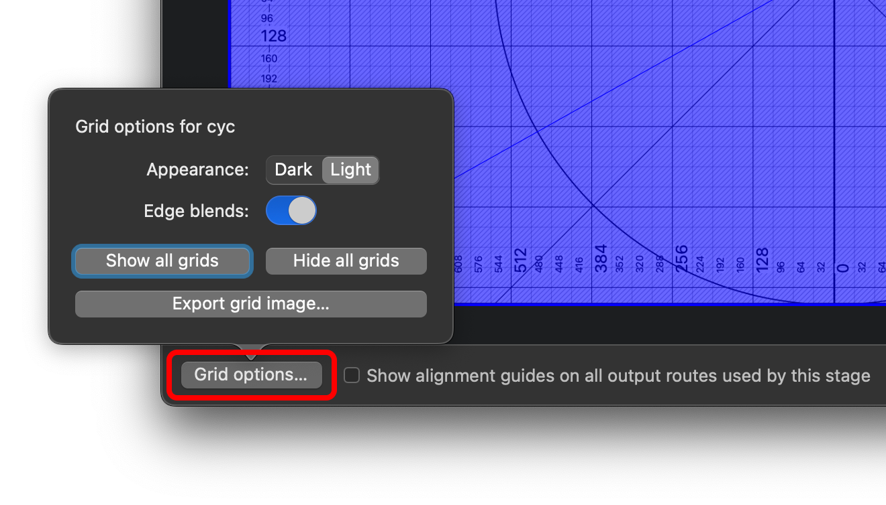

# QLab Video & Surface Mapping

This section covers the general process for getting high-quality, unwarped mapping onto physical surfaces such as a cyclorama.

> [!IMPORTANT]
> You are **_STRONGLY RECOMMENDED_** to review the relevant QLab documentation in full before this. The most important section is [**QLab: Video Output**](https://qlab.app/docs/v5/video/video-output).
>
> While Sloan's computers are almost always ready to go, it's always a good idea to stay up-to-date on [Preparing Your Mac: Video](https://qlab.app/docs/v5/general/preparing-your-mac/#if-youre-doing-video) which explains how to handle many Mac-related headaches for you.

## Projector Configuration/Placement

There are 2 goals when deciding on projector placement and physical settings (zoom, lens shift, etc):

1. **Coverage**. The projector should cover the entire surface you wish to cover (which usually means substantial bleed). Aim for the minimum amount of bleed possible to maximize image quality.

   Try to be aware of where the actual edges of the projector's coverage are—aim for non-reflective surfaces if possible, otherwise a lamp line may become visible during blackout conditions.

1. **Shadows**. The angle of the projector to the screen will determine how commonly performers and set pieces cast shadows on the screen.

> [!IMPORTANT]
> Avoid using the projector's keystone option if possible. You should only make physical changes: either moving the projector, or moving a motorized zoom/focus/lens shift setting. All digital signal processing (like keystoning) should be handled by QLab to minimize distortion.

The [beginning of the surface mapping section](#detailed-surface-mapping) shows what this might look like when done correctly.

## Device Setup

Start by getting the projector connected to the Mac. Using an ethernet extender, commonly a Crestron DM Transmitter, is acceptable as long as your cable length is within spec (usually <100 meters). Other transmission formats are preferred (e.g. 3G-SDI) when possible.

**Always make sure video output devices are connected to the Mac before starting QLab.** If you connect a new video output, you should restart QLab before continuing.

In your QLab workspace, go to `Workspace Settings > Video > Output Devices` and make sure the projector appears in the list.

Switch to the `Output Routing` tab and make sure your projector has an Output Route—if it doesn't, create one. (This is also a great place to rename your projector if it has an unhelpful name.)

## Create a Video Stage

1. In the `Video Outputs` tab, create a New Stage with your projector output and open it using the `Edit` button.

   

1. You can use the stage `Grid options...` tab to project an alignment grid in black or white.

   

1. Fix the video cue template. Set the default video output to your new surface. (Same goes for camera and text cues, if you plan to use them.)

   

## Detailed Surface Mapping

Let's say you'd like to project onto a cyclorama like this.

&nbsp;

When you display your QLab alignment grid (see above), it should look something like the image below.

Notice that we have already used projector settings to optimize the coverage:

1. The full cyc is within projector coverage and in focus.
1. Bleed is mostly in areas people won't notice lamp bleed, like the floor.
1. The projector isn't doing any digital keystoning—we'll do that in QLab.

### Corner matching

Next, go to the `Warping` tab in the stage editor. Make sure the `Warp Type` is set to **Perspective** for now. Use the yellow corner dots to align the edges with the cyc.

> [!TIP]
> You can use the arrow keys to adjust a selected control point by 1 pixel at a time.  
> Selecting a control point can be difficult as it will often move when you click it. To fix this, select a control point by clicking and dragging it substantially, then <kbd>⌘</kbd> <kbd>Z</kbd>. This will ensure you don't accidentally move any control points when you don't mean to.

### Fix the aspect ratio

Now, we need to correct the aspect ratio. This requires a few measurements and some simple math.

1. **Measure the distortion**. Take a ruler or tape measure and measure the dimensions of a few squares on the physical surface. (5 or 6 far away from each other should do well.)

1. **Average your measurements.** Find an average value for width and height of your measured squares. We'll use variables $S_h$ and $S_w$ (height and width) to define those average dimensions.

1. **Calculate**.

   If the squares are **wider than they are tall**, you'll remove resolution from the **height**.  
    If the squares are **taller than they are wide**, you'll remove resolution from the **width**.

   Based on that, choose ONE of the below equations to find the new height or width. $D_h$ means the current stage height in pixels.

   $$D_h'=\frac{S_h}{S_w}\left(D_h\right) \ \ \ \ \ \ \ \ \text{- OR -} \ \ \ \ \ \ \ \  D_w'=\frac{S_w}{S_h}\left(D_w\right)$$

   **EXAMPLE**

   

   Let's say our square measurements yielded an average of **4x3 inches**.

   Since $S_w>S_h$ we need to **reduce the stage height**.

   Our original projector resolution is 1920x1080, so $D_h=1080 \text{px}$.

   That makes the new height:

   $$D_h'=\frac{3}{4} \left(1080\right) = 810 \text{px}$$

1. **Rescale the surface.** Click the `Resize...` button at the top of the window.

   

   Uncheck `Preserve Stage Aspect Ratio` first, then type your new dimension in.  
   Set `Apply to Regions` to **Crop/Pad** and keep the selector in the center.  
   Click OK!

### Fine tuning

You should now have a very close surface mapping.

If you need to make more detailed edits to the mapping, go back to the `Warping` tab and switch the `Warp Type` to **Bézier**. This gives you many more control points to more finely adjust the edges. Be careful not to do anything too drastic—arrow keys are recommended.

## Surface Masking

If you have a situation where something is obscuring the clean edge of the surface, here is how you fix it.

For example, let's say this large triangular set piece will be directly in front of the cyc.

QLab needs a **mask image** to black out any areas you don't want to project on. The simplest process for creating one accurately is:

1. **Take a photo of the space** with the QLab alignment grid showing. Try to take it from a distance, from a similar angle as the projector if possible.

1. **Export an alignment grid image** from QLab. You can do this from the `Grid options` menu.

1. **Superimpose the two images**. Open the QLab alignment grid in an image editor. Import the photo you took on top, and perspective warp it until the two grids line up as best you can manage.

1. **Draw a mask.** Fill the frame with black and white pixels to represent the edges of the object. White pixels will be shown, black pixels will be hidden, and anything in between will be partially transparent.

1. **Load the mask** into QLab. You should see it immediately represented on the surface, and you can update the image file as needed with edits.

The final mask for the set piece shown above might look like this:

**What image editor should I use?**

Anything that allows superimposing images, has a simple drawing tool and a perspective warping tool. There are lots of good options; a few that would work well are Photoshop, Affinity, GIMP, and Figma.

## Art-Net Shutter Control

QLab can use Art-Net to control the projector options, most importantly power on/off and shutter open/close.

You'll these cues in the "SYSTEM CONTROL" cue list, which is included in the [base QLab template](https://github.com/Sloan-Performing-Arts-Center/venue-audio/raw/refs/heads/main/SHOW%20FILE%20BACKUPS/SLOAN%20BASE%20-%20QLab.qlab5template).

Either fire them directly, or you can create Start cues that target them and then use those in your own cue list.

### Hotkey shutter control

During technical rehearsals, you may find it beneficial to manually open/close the projector shutter. To do this, you can arm the **hotkey shutter controls** group shown above.

This will enable the keyboard shortcuts <kbd>G</kbd> and <kbd>H</kbd> for shutter open and close, respectively.

&nbsp;

> How to arm/disarm a cue
