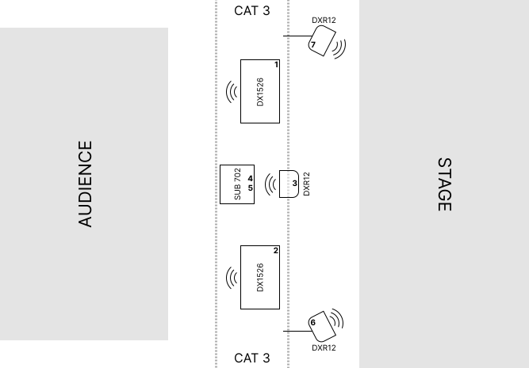

# Sloan Dance Rep - Audio/Video System

The Sloan Dance Repertory Plot is our proscenium-like setup used for dance department performances and various other events. During most academic semesters, this plot remains in the space for a sequence of multiple shows. It features the standard west-facing audience on fully-extended risers, and a standard soft-goods package of 6 legs, an upstage traveler, and an upstage cyc with projection capability.

## Contents

This section covers specifications and setup information for audio and video systems.

- [Setup Instructions](setup.md)

- [PATCH Tables](patch.md)

- [Extending the system (adding audio inputs and outputs)](extending.md)

- [Projections Guide (instructions for choreographers)](projections.md)

  > This guide has instructions for making media files to fit on the cyc. Send it to those planning events as needed.

## Setup Checklist

Completing these steps in full will ensure a working system.

1. **[Place/hang 5 speakers](setup.md#analog-setpatch)**: Main C, Sub 1, Sub 2, Monitor L, Monitor R

1. **Set the patch**: 5 analog patch cables. [See the "Wall Port" column in this table](setup.md#speaker-installation).

1. **[Set the sound table](setup.md#setting-the-sound-table)**.

1. **[Load base show files](setup.md#load-all-base-show-files)**.

1. **System testing**. Run signal through all speakers to ensure they're working correctly.

1. **[Extend the system as needed](extending.md)**: Add analog inputs, digital inputs, additional speakers, etc.

1. **[Video System Setup](setup.md#qlab-load-the-cyc-projection-map)**: Import the QLab video mapping and adjust it for the new hang.

   See the [general video setup/mapping guide](../extras/qlab_video.md) for more details.

## Overhead Speaker Plot

