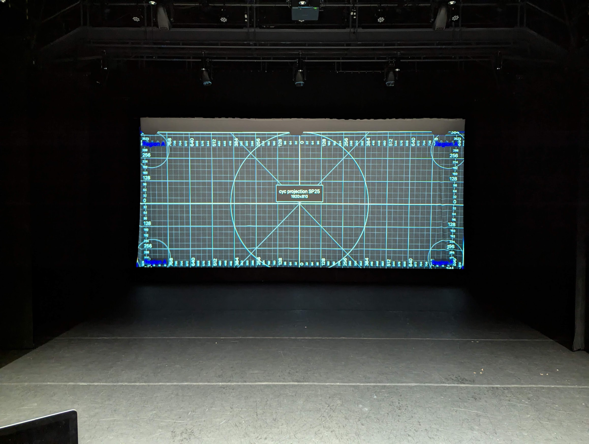
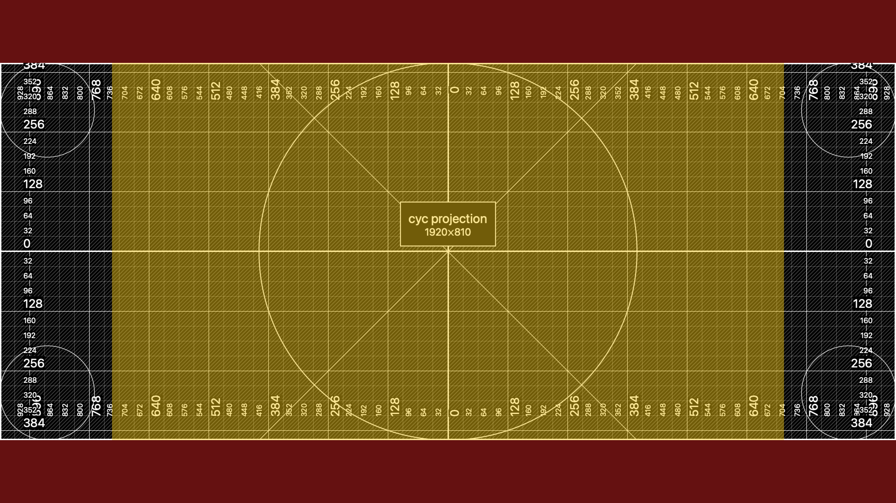
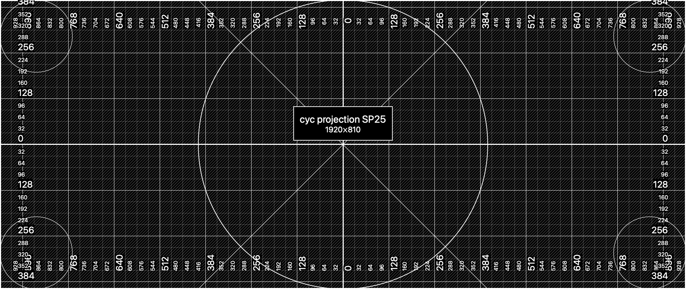

# Dance Rep: Projections

The Dance Rep setup uses a full-cyc projection upstage. The resolution is **1920x810px**.

## Tips for creating media

Standard videos and images in the standard aspect ratio 16:9 (a.k.a. 1080p, 4k, etc) **do not fit properly on this size of screen**.

> 16:9 sources must either be cropped (red) or letter-boxed (yellow) when they are shown in the space.

### Preparing media for SPAC

For best results, you should try to export all images and videos at a size of **1080x810px**. This gives you full control over how to display each video file.

When preparing media, reference the image at the top of this page to make sure your source will fit the cyc, and that nothing important is being cut off at the edges of the screen. (You can also download the alignment grid [below](#download-the-reference-grid).)

Video files may have their own audio, or you may provide a separate audio file to play alongside the video. Either way, they will play perfectly in sync.

### During tech

During technical rehearsals, the QLab programmer will be able to move your video source to anywhere on the cyc, including cropping, panning, and scaling.

They will most likely only be able to accommodate one video location per file, so **if you'd like your video to play in two different sizes/positions, export them as two separate video files**.

## Download the Reference Grid

You can use the raw reference alignment grid below to perfectly render your video sources for this space.

First, import this image into your video/image editor. You can then choose locations in the physical space by referencing the picture shown above and aligning them with the grid in your project.

Use `Right-click > Save Image As...` to download the alignment grid below.

