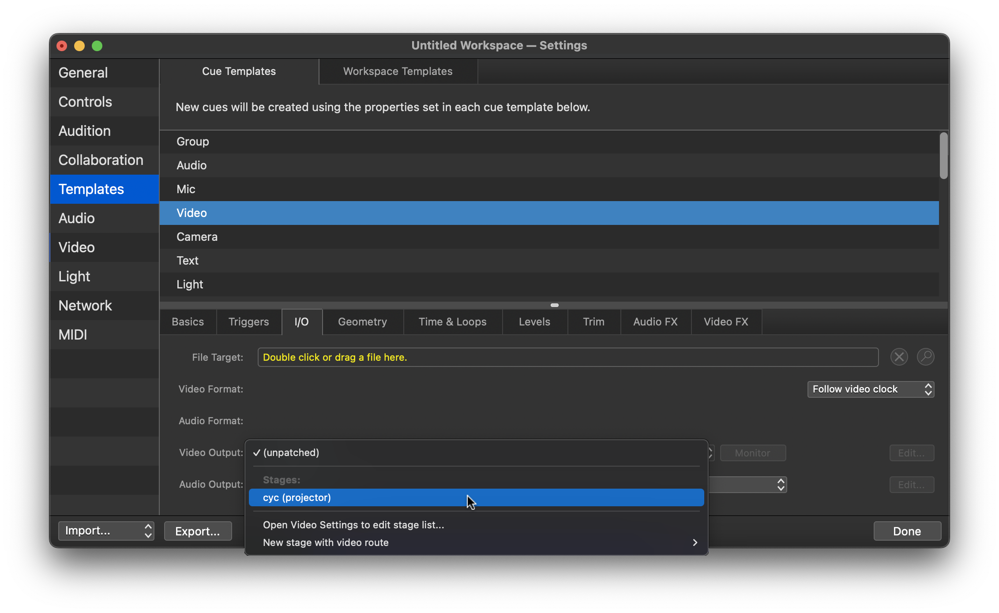

# System Setup: Dance Rep

## Analog Set/Patch

**Always follow the [patch cable color code](../specs.md#patch-bay-color-code)** when installing.

**Refer to the [patch plot](patch.md) to find/verify all specific patch points.**

### Speaker Installation

This standard plot requires adding **5 speakers**, making 7 total including the permanent mains pair. The added 5 speakers have emphasized numbers (**_#_**) in the table below.

> [!NOTE]
> Speakers 4-7 in the table below are plugged into the permanent rep audio panel found at the center of catwalk 3. Each speaker has its own labelled port. This is denoted `CAT3-#` in the table below.

| #       | Name            | Unit           | Location                             | Purpose                                          | RIO Output | Wall Port |
| ------- | --------------- | -------------- | ------------------------------------ | ------------------------------------------------ | ---------- | --------- |
| 1       | Main&nbsp;L     | Fulcrum DX1526 | **_permanently installed_**          |                                                  |            |           |
| 2       | Main&nbsp;R     | Fulcrum DX1526 | **_permanently installed_**          |                                                  |            |           |
| **_3_** | Main&nbsp;C     | Yamaha DXR12   | Catwalk 3 - US Toe Pipe              | Center fill                                      | OUT 1      | A58       |
| **_4_** | Sub&nbsp;1      | RCF 702-AS II  | Catwalk 3 Floor - DS Center          | FORWARD (bottom) unit in cardioid stack          |            | CAT3-1    |
| **_5_** | Sub&nbsp;2      | RCF 702-AS II  | Catwalk 3 Floor - DS Center          | REVERSE (top) unit in cardioid stack             |            | CAT3-2    |
| **_6_** | Foldback&nbsp;L | Yamaha DXR12   | Catwalk 3 - US Midrail with side arm | monitoring for performers. STAGE LEFT.           |            | CAT3-3    |
| **_7_** | Foldback&nbsp;R | Yamaha DXR12   | Catwalk 3 - US Midrail with side arm | monitoring for performers. STAGE RIGHT.          |            | CAT3-4    |
| 8       | Floor Mon 1     | Yamaha DXR12   | Stage floor                          | Stage wedge monitors. _Don't run unless needed_. | OUT 2      | A13       |
| 9       | Floor Mon 2     | Yamaha DXR12   | Stage floor                          | Stage wedge monitors. _Don't run unless needed_. | OUT 3      | A14       |
| 10      | Floor Mon 3     | Yamaha DXR12   | Stage floor                          | Stage wedge monitors. _Don't run unless needed_. | OUT 4      | A21       |
| 11      | Floor Mon 4     | Yamaha DXR12   | Stage floor                          | Stage wedge monitors. _Don't run unless needed_. | OUT 5      | A22       |

More information on the **_optional_** floor stage monitors is available in [extending the system](extending.md#add-floor-wedge-stage-monitors).

The wall ports listed are only recommendations. You can use any wall ports, as long as the RIO output lines up with the specified speaker as listed.

### Specific Speaker Prep

#### Center Fill

The Main Center should be hung at the centerline on the upstage toe pipe of catwalk 3.

Focus: **43.5° down from vertical**.

Settings:

- Ch.1 Gain at detented 0dB mark
- switch Mic/Line to Line level
- turn other channels' gain off
- input LED turned off
- both frequency switches set to flat/off

#### Subs

The two subs should be stacked one on top of the other. The bottom unit should have its grill facing the audience side. The top unit should have its grill face the upstage wall.

Check that both subs match the following settings:

- Crossover set to **110 Hz**
- Polarity set to **forward**
- Gain set to **3 o'clock**. (This is NOT recommended for any other system, but clipping is accounted for elsewhere in this system.)

#### Mains (Fulcrums)

The fulcrum mains should be focused so that the back side of the cabinet is **22.5° from vertical**. (We measure from the back due to the curved grille.)

## Setting the Sound Table

By convention, the sound control table is generally placed on the mezzanine, just outside of the tech booth. Directly to the right of this position is a support pillar, which has a set of patch points on its west side.

**Ensure you have located all items needed:**

1. Audio Console. (Yamaha QL5)
1. Control Computer. (2020 iMac 27")
   - Typically, "Tech Office 2" is used as the primary computer. Both iMacs have identical software packages, but certain files may be more readily available on this one.
1. Crestron DM Transmitter for video transmission.
1. Tripp Lite UPS Battery Backup.
1. Network switch for audio control network.
1. Wired Comms for operator.

### Cables to run

Run the following cables to connect the sound table into the house system.

#### Dante Audio:

1. **Dante to QL5.**

   Run 2 ethernet lines: Dante Primary and Dante Secondary. Use the dedicated Dante Primary/Secondary ports on the wall panel.

1. **Dante to computer.**

   Run 1 ethernet line from the **built-in ethernet jack** on the Mac to a dedicated **Dante Primary** port on the wall panel.

> [!NOTE]
> For Dante audio, please use the large blue audio snake if available, using the **4 colored ethercon lines** to connect audio paths.

#### Control Network:

1. **Control to network switch** ← D102.

   Run ethernet into the portable network switch from **wall panel port D102**. (This should be permanently connected to the control network.)

1. **Network switch to console.**

   Run ethernet from the portable switch to the QL5's  network port.

1. **Network switch to computer.**

   Run ethernet from the portable switch into the Mac's included thunderbolt-to-ethernet adapter.

> [!IMPORTANT]
> The control network _must_ be plugged into the adapter, and Dante _must_ be plugged into the built-in network jack. **Each port is configured with distinct IP address settings.**

#### Video/Comms:

1. **DM Transmitter (video signal) to PTP port.**

   Connect the DM transmitter to the Mac using HDMI.

   Run ethernet from the Crestron DM Transmitter output into a point-to-point ethernet port on the wall panel.

   Use the patch bay to run this signal to another point-to-point that can reach the projector.

1. **Operator comms**.

   Run a comms box from **comms channel A**.

## Load All Base Show Files

Once the table is connected to the system, power on the console and computer.

**You will need to load 3 base show files.**

1. QL5 Base Show file.

   1. SETUP > SAVE/LOAD to access show files.
   1. Load the **`000 SLOAN BASE.clf`** show file, found in the root folder.

1. Dante Patch Preset.

   1. Open **Dante Controller** on the Mac.
   1. **WAIT** for devices to show up on screen. If they don't, see [troubleshooting](../troubleshooting.md#network-connection-issues-on-mac).
   1. Use the Load Preset option (File menu) to load `Desktop/SYSTEM PRESETS/SLOAN BASE.xml`.
   1. Click OK on the popup (use the default options that come up.)

1. TF-RACK Base Scene.
   1. Find the installed Yamaha TF-RACK in the rack room.
   1. Go to the scene menu in the top left corner.
   1. Load the **`TF BASE`** scene, which is the first available.

Show files should be available in their respective locations (Mac Desktop, QL5 show files drive, etc.) but [they can also be found online here](https://github.com/Sloan-Performing-Arts-Center/venue-audio/tree/main/SHOW%20FILE%20BACKUPS#readme).

### Wireless Microphone Gain

Once you have loaded the QL5 base file and the Dante patch, you should be able to control the wireless microphone gain using the console.

**Start by setting wireless microphones to `16 dB` of gain.** (Wireless gain is not recalled in the show file.)

You can recall wireless gains, names, and frequencies using the `SLOAN BASE - Wireless Workbench.shw`. Open the file in Wireless Workbench, and when you do you will be prompted to recall settings. Choose "**Keep all settings from: Wireless Workbench**" and then click **Apply to all**.

---

## Additional Audio Setup

### SM Voice of God (VOG) Mic

Ensure the SM VOG is set up and working, both backstage and through the mains.  
[See instructions here](../specs.md#sm-voggod-micpaging-microphone-system).

### PZM Stage Mics

Four Shure Beta 91A pressure-zone microphones are available to be used as foot mics/tap mics. They are generally placed along the downstage edge of the proscenium.

Plug them into wall ports M21-24. They will come through on channels 5-8.  
([See the input patch table](patch.md#ql5-console-inputs).)

> [!NOTE]
> On the console, the PZM mic channels have all parameters linked except for their faders. You can EQ them together and process them together, but still control individual levels as you wish.

## QLab: Load the Cyc Projection Map

Make sure you've first [hung and focused the projector correctly](../extras/qlab_video.md#projector-configurationplacement).

Then, you'll need to import and refine the base surface mapping for the dance rep cyc position.  
(Get it from "SYSTEM PRESETS" or [download it here](https://github.com/Sloan-Performing-Arts-Center/venue-audio/tree/main/SHOW%20FILE%20BACKUPS#readme).)

### Importing the starter file

1. **Import the video mapping**.

   Drag the `.qlabsettings` file into the video stages window of QLab. You should see a new **cyc projection** stage appear.

   

1. **Set the mapping as default**.

   Go to Cue Templates, and change the default video output to your new stage.

   

### Adjusting the mapping

> [!IMPORTANT]
> You'll need to adjust the map each time this plot is hung.

The imported video map should be roughly lined up with the cyc, but you'll need to fine-tune based on your current setup.

1. **Show the alignment grid**.

   Click `Edit...` on the video stage, and show the grid in the Grid Options menu. Choose dark or light as needed.

   

1. **Map the corners**. In the `Warping` tab, adjust the corners of the screen to line up with the cyc. You can use the arrow keys to make fine adjustments.

   It's often easiest to do this by walking right up to the cyc itself.

1. **Fine adjustments using Bezier warp**.

   Once you've lined up the corners, switch the `Warp Type` to **Bezier**. This will give you many more control points to adjust.
