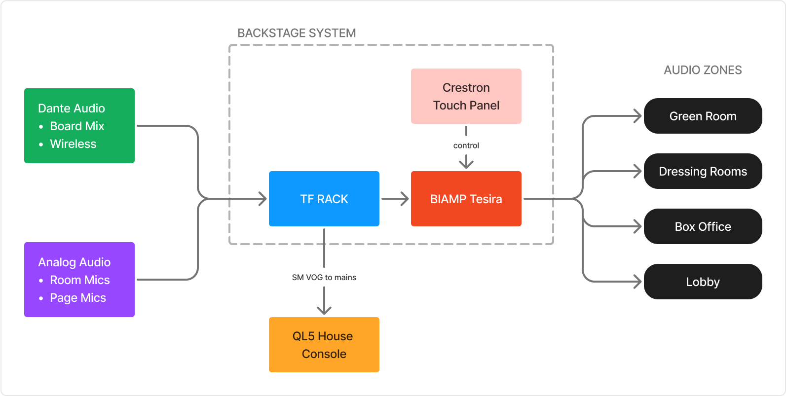
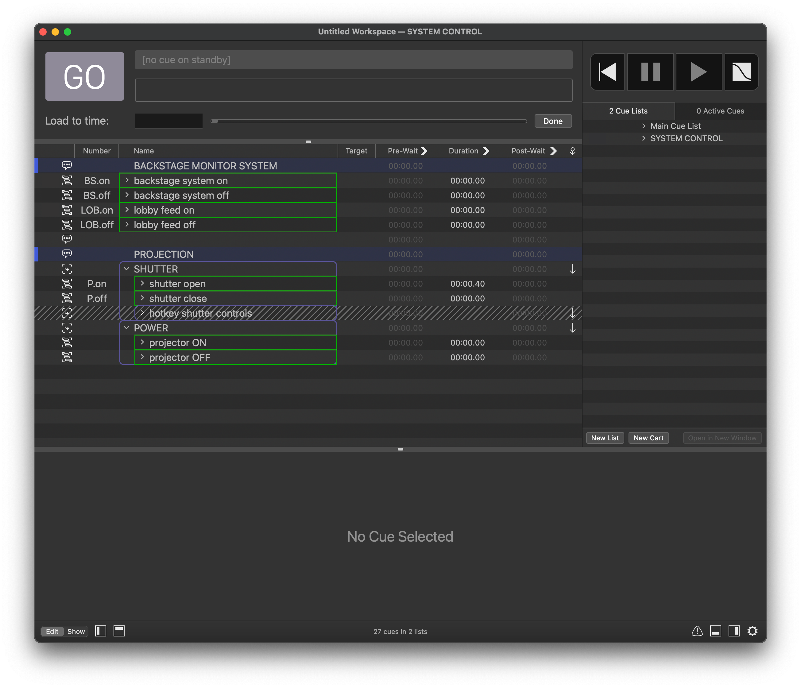
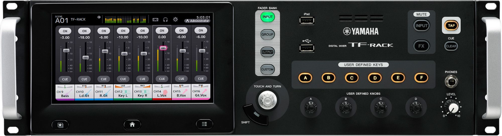
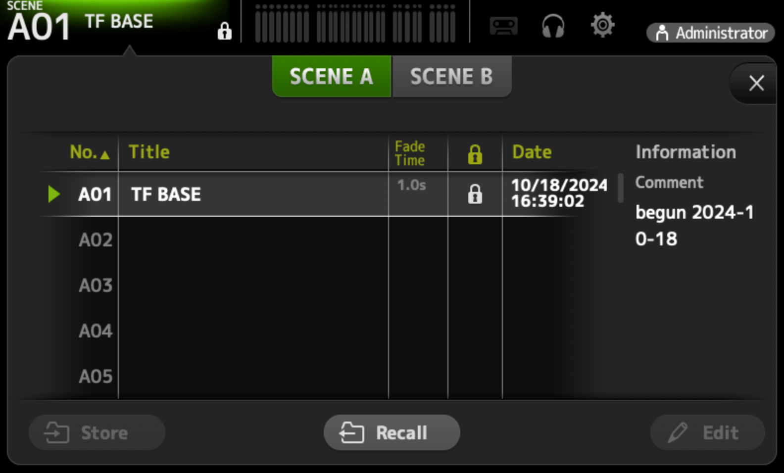
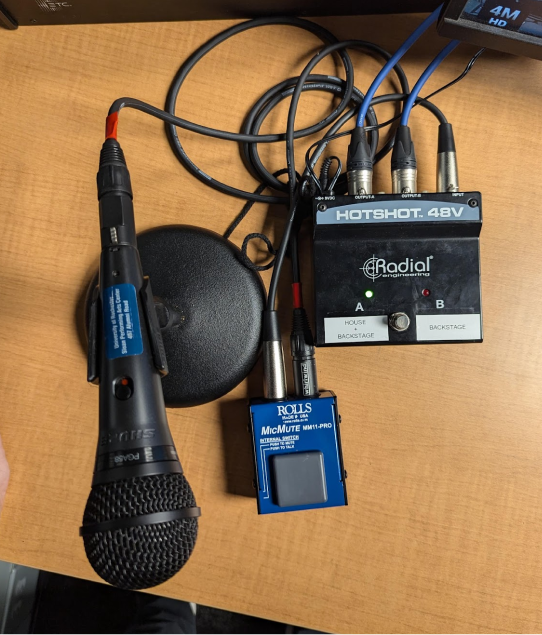

# Permanent Specifications

This section covers aspects of the space which are used for all shows, at all times.

## Patch Bay Color Code

The Patch bay uses a color-coding scheme to signify different uses for a patch point. **Colors in this table are shown in order from most permanent to least permanent.**

> [!IMPORTANT]
> Note that **labelled patch cables are the exception to the color code below.** Before removing or changing a patch cable, always double check that it doesn't have a labelled purpose on either end.

| Cable Type                       | Purpose              | Notes                                                                                                                                                                                                                              |
| -------------------------------- | -------------------- | ---------------------------------------------------------------------------------------------------------------------------------------------------------------------------------------------------------------------------------- |
| ${\color{green}\text{Green}}$    | Permanent&nbsp;Patch | These cables should be left **connected at all times**. Any changes made to green connections must be documented and reported to the Operations Manager.                                                                           |
| ${\color{blue}\text{Blue}}$      | Season&nbsp;Patch    | These cables are for connections that last for **multiple shows in a row**, such as for the entire dance season.                                                                                                                   |
| ${\color{red}\text{Red}}$        | Show&nbsp;Patch      | These cables are for connections used **during the current show only**.                                                                                                                                                            |
| ${\color{#DAA520}\text{Yellow}}$ | Tech&nbsp;Patch      | Use these cables for connections that will **need to change during the current show's production**. This is most commonly used to connect to temporary tables during technical rehearsals, which are struck upon a show's opening. |

&nbsp;

**Please strike patch cables as described below:**

### After technical rehearsals

Remove/move all **${\color{#DAA520}\text{yellow}}$** patch cables, as needed.

### When striking any show

Remove all **${\color{red}\text{red}}$** cables and any remaining **${\color{#DAA520}\text{yellow}}$** cables.

### When striking a rep plot

Remove all **${\color{blue}\text{blue}}$** cables and any remaining **${\color{#DAA520}\text{yellow}}$** or **${\color{red}\text{red}}$** cables.

---

> TODO let's get an annotated photo of the blank patch bay, green/permanent only

---

## Permanent Patch Points

The following patch points should always be connected, to at least one side.

| Purpose                    | From                 | To             | Notes                                                                                                                                   |
| -------------------------- | -------------------- | -------------- | --------------------------------------------------------------------------------------------------------------------------------------- |
| Room Mics LR               | M57-58               | TF IN 1-2      | for backstage feed                                                                                                                      |
| Network Cam                | D88                  | Campus Network | for lobby video feed                                                                                                                    |
| SM Video Camera            | D89                  | `CAM 1`        | Camera feed into distributor                                                                                                            |
| SM VIDEO OUT               | SM Out (unlabelled?) | D107 (default) | DEFAULT to SM video monitor. This can be moved for shows but should return here.                                                        |
|                            |
| Audio Control to Mezzanine | Control Switch       | D102           | If you need to use the sound console elsewhere, do not strike this cable. Just patch an additional PTP into the control network switch. |
| Audio Control to Booth     | Control Switch       | D108           | Typically connects to ETC Ion's Port 2 for OSC control.                                                                                 |

## Backstage Audio Monitoring (Tesira/Crestron/TF)

The backstage monitoring system can be used to pass audio into most rooms around the building. Reference the system diagram below, but generally:

Use the **TF-RACK** to prepare backstage feeds; you can mix together room mics and page mics with other sources as needed.

Use the **Crestron Touch Panel** to choose which feed goes to which room.

### System Diagram

&nbsp;

The only two sources used by default are the permanently-installed room mics, and the SM VOG microphone. (Those are both green analog patches, so make sure they're [plugged in](#tf-input-channels).)

### Backstage zones

Audio can be routed to various locations throughout the building using the installed AV system (Crestron/Tesira). The system is divided into the following zones:

- Zone A: **Main Lobby**
- Zone B: **Lobby Left Side** (by the theater entrance door)
- Zone C: **Bathrooms**
- Zone C2: **Front Offices**
- Zone D1: **Green Room** - _only_ the green room itself.
- Zone D2: **Production Support**. This includes:
  - Tech booth (mezzanine)
  - Dressing rooms
  - Green room hallway
  - Conditioning lab
  - Costume shop
  - Student tech office (mezzanine level)

### Controlling the backstage system with QLab

The base QLab template has a cue list for controlling the backstage system. ([Download the template here](https://github.com/Sloan-Performing-Arts-Center/venue-audio/raw/refs/heads/main/SHOW%20FILE%20BACKUPS/SLOAN%20BASE%20-%20QLab.qlab5template))

You can either fire these directly, or you can create Start cues that target them and then use those in your own cue list.

#### backstage on/off

Running these cues will turn on/off the room mics in the backstage feed, and anywhere else you have routed them.

#### lobby on/off

Running these cues will turn on/off the lobby feed.

### TF Rack

Recall the `TF BASE` scene to return the TF to default settings.

> 

The default includes:

- The SM Page mic is patched to all backstage zones.
- The room mics are patched to all backstage zones, but turned off by default.  
  You'll usually want to turn them on/off [using QLab cues](#controlling-the-backstage-system-with-qlab).

#### TF input channels

| Input | Purpose         | Patch&nbsp;Type | Signal&nbsp;From | Notes                                           |
| ----- | --------------- | --------------- | ---------------- | ----------------------------------------------- |
| 1     | XY Mic Pair (L) | Physical        | M57              |
| 2     | XY Mic Pair (R) | Physical        | M58              |
| 3     | Mix from QL5    | Dante           | QL5              |
| 4     | Mix from QL5    | Dante           | QL5              |
| 5     | SM Announce Mic | Physical        | A107 (default)   | Patch to wherever the stage manager is located. |
| 6     | SM Page Mic     | Physical        | A108 (default)   | Patch to wherever the stage manager is located. |

#### TF output channels

| Output | Purpose        | Patch Type | Signal To            | Notes              |
| ------ | -------------- | ---------- | -------------------- | ------------------ |
| 1      | Backstage Feed | Dante      | Tesira Monitor_Sys_1 | Dante 1 (Crestron) |
| 2      | ALS System     | Physical   | `ALS IN` patch port  |
| 3      | Lobby Feed     | Dante      | Tesira Monitor_Sys_2 | Dante 2 (Crestron) |

## SM VOG/God Mic/Paging Microphone System

The SM Voice of God system allows the stage manager to either announce messages directly backstage, or into the theatre and backstage.

The roaming system is made up of three primary components:

- **Shure PGA god mic** - leave its switch turned on.
- **ROLLS push to talk button** - use this to talk through the system.
- **Radial A/B switcher** - choose between output locations.

### SM VOG Setup

The Radial switcher has 2 XLR outputs, both of which need to be connected to the backstage TF-RACK.

**Connect outputs A and B to a nearby wall panel**, and then **use the patch bay to connect them to TF Inputs `5` and `6`.**

In the patch bay, this connection uses dedicated, labelled patch bay cables.

### Listening through the mains

When on Channel A, signal will be sent into the QL5 on channel 64 for distribution to the theatre sound system. In the SLOAN BASE files (dance rep), this will work automatically. If you are running a SLOAN BLANK show, you'll need to route channel 64 to wherever you need it.
