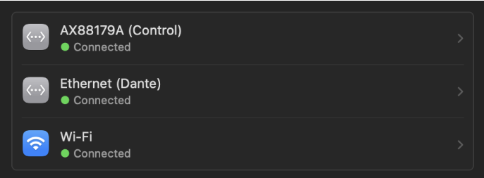
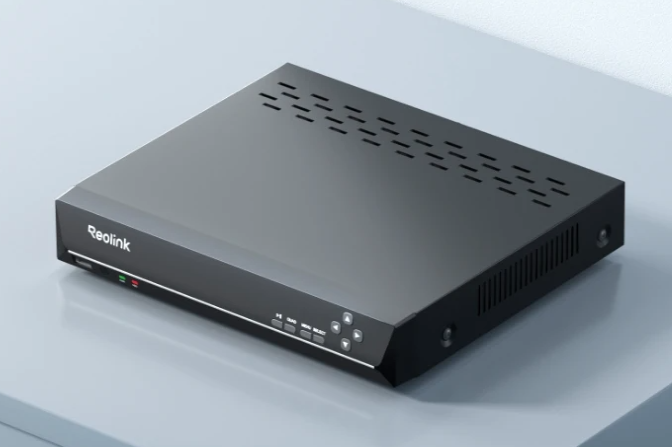

# Troubleshooting

Common errors with the audio, control, and video systems are found here.

## Corrupt or Broken Show Files

If you suspect a base show file is broken, backups for all show files can be found in [this folder](SHOW%20FILE%20BACKUPS/).

## Network Connection Issues on Mac

If Dante Controller shows no devices, or there are signs of a failed connection to the control network, try the following things.

1. **Are network devices showing as connected?**

   On the Mac, navigate to `System Settings > Network`. Both ethernet connections should show a green _Connected_ message.

   

   If either is not green, first check the [physical network connections](rep/setup.md#cables-to-run).

1. **Are both networks in their correct port?**

   The audio control network _must_ plug into the ethernet adapter, while the Dante network _must_ plug into the Mac's built-in ethernet port. Check that they are not reversed.

1. **Are any networks being bridged together?**

   There are 5 primary networks in the Sloan space, all of which must always remain separate from each other. They are:

   - Audio System Control (192.168.0.X)
   - Dante Audio Primary (135.254.16.X)
   - Dante Audio Secondary (172.254.16.X)
   - Campus Internet (10.5.X.X)
   - ETC Lighting Network (10.101.X.X)

   Ensure there is nowhere two of these networks go into the same network switch, and that any computer connected to more than one has subnet masks placed to separate them.

> [!IMPORTANT]
> DO NOT connect to audio/control networks using the Mac's WiFi.
>
> If the WiFi is connected to the campus internet and using an automatic (DHCP) IP address, there should be no conflicts with the control/audio systems.

## SM Video Feed is Frozen

If the video monitor used by the Stage Manager is freezing (showing a still image or nothing at all), there is a simple fix.

You'll need to **power cycle the distributor unit** to return the feed to normal.

The distributor is a [Reolink NVR](https://reolink.com/us/product/rln8-410/), shown in the image below. Head to the patch room; it is **on the lower right side of the audio racks**, underneath the Yamaha TF-Rack mixer.

**Use the power switch on the back side to flip the power off and on again.** Wait a few seconds for the unit to reboot.

